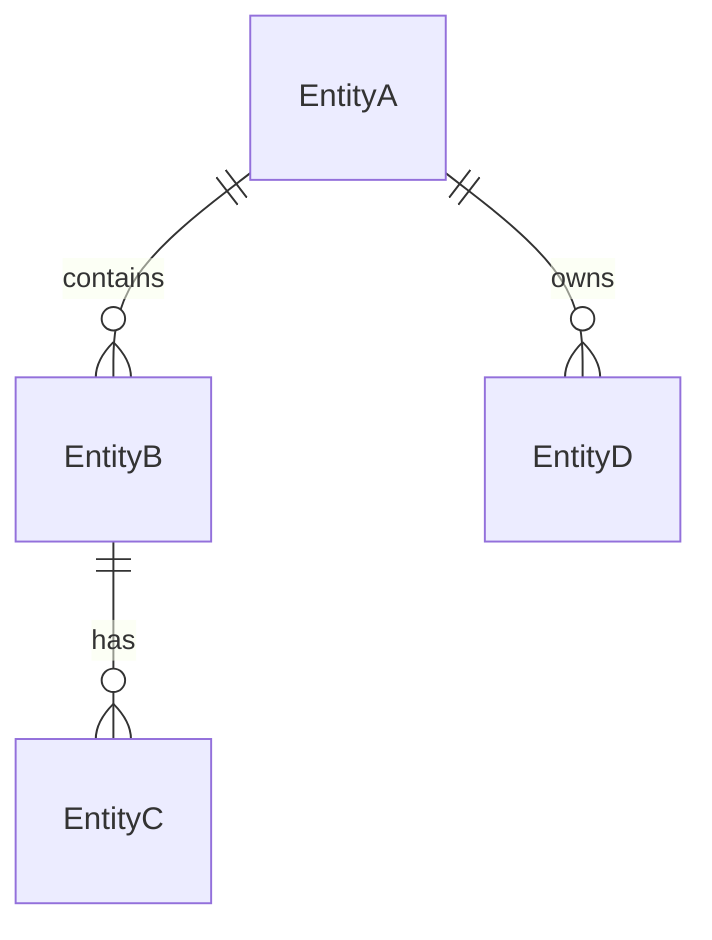

# Architecture

## System Diagram

```
┌─────────────────────────────────────────────────────────────────┐
│                     <Client Layer>                               │
│  <Framework> + <UI library>                                      │
│  <How client talks to server>                                    │
└──────────────────────────────────┬──────────────────────────────┘
                                   │  <Protocol / endpoints>
                                   ▼
┌─────────────────────────────────────────────────────────────────┐
│                     <Server Layer>                               │
│  <Routers / handlers> · <Auth> · <ORM>                           │
└──────────────────────────────────┬──────────────────────────────┘
                                   │  <Database client>
                                   ▼
┌─────────────────────────────────────────────────────────────────┐
│                     <Database>                                   │
│  <Port / connection details for dev>                             │
└─────────────────────────────────────────────────────────────────┘
```

## Technology Choices

| Layer | Technologies | Rationale |
|-------|-------------|-----------|
| **Framework** | <e.g., Nuxt 4 (Vue 3 + Nitro)> | <Why this framework over alternatives> |
| **UI** | <e.g., Tailwind CSS, shadcn-vue> | <Why these UI tools> |
| **API** | <e.g., tRPC + Zod> | <Why this API approach> |
| **Database** | <e.g., PostgreSQL + Prisma> | <Why this DB and ORM> |
| **Auth** | <e.g., sessions + OAuth> | <Why this auth strategy> |
| **Testing** | <e.g., playwright-bdd + Bun test> | <Why this testing approach> |
| **Infra** | <e.g., Docker Compose + cloud> | <Why this deployment model> |

## Project Structure

```
<project>/
├── app/
│   ├── pages/                 # <description>
│   ├── components/            # <description>
│   └── composables/           # <description>
├── server/
│   ├── api/                   # <description>
│   └── utils/                 # <description>
├── prisma/
│   ├── schema.prisma          # <description>
│   └── migrations/            # <description>
├── docs/                      # <description>
└── <config files>
```

## Key Domain Concepts

| Concept | Description |
|---------|-------------|
| **<Concept 1>** | <What it is, key constraints, how it relates to other concepts> |
| **<Concept 2>** | <Description> |
| **<Concept 3>** | <Description> |

## Data Model



### Enums

| Enum | Values |
|------|--------|
| `<EnumName>` | VALUE_A, VALUE_B, VALUE_C |

## Data Flow: <Primary User Action>

1. <User interaction that triggers the flow>
2. <Client-side processing>
3. <API call>
4. <Server-side validation and processing>
5. <Database operation>
6. <Response and UI update>

## Deployment

- **Development**: <Local setup — e.g., Docker Compose for DB, dev server command>
- **Production**: <Build and deployment target>
- **Infrastructure**: <Where infra config lives>
