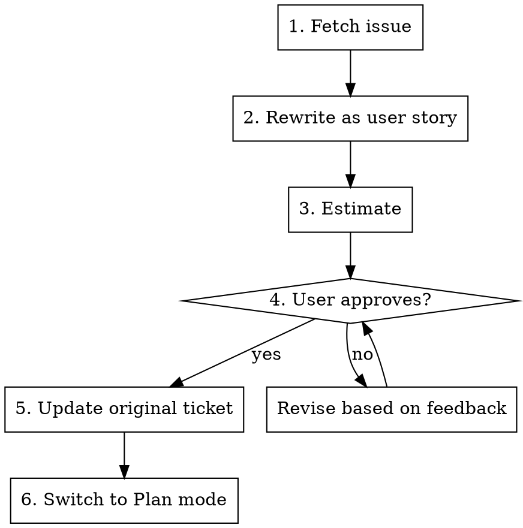

# Developing Tickets

Orchestrate the full lifecycle of working on a ticket — from fetching the issue, through story refinement and estimation, to user approval, ticket update, and implementation handoff.

<trigger>
The user says something like:

- "develop PP-123"
- "work on PROJ-456"
- "implement #78"

where the reference identifies an issue in Jira, GitHub, or another tracker.
</trigger>

## Project Configuration

This skill relies on two project-level settings. Check `AGENTS.md`, `.cursor/rules/`, or any project config for:

1. **Issue tracker** — which system holds tickets and how to fetch them (e.g. `jira`, `github`)
2. **Issues directory** — local path where issue markdown files are stored (e.g. `docs/issues/`)

If either setting is missing, stop and ask the user to define it before proceeding. Suggest sensible defaults:

```
Issue tracker: jira | github
Issues directory: docs/issues/
```

Once the user confirms, note the values for the rest of the session (do NOT write them to project files — the user decides where to persist configuration).

## Workflow

Follow these phases in order. Complete each phase before moving to the next. Ask for confirmation where indicated.



### Phase 1 — Fetch the issue

**REQUIRED SUB-SKILL:** Use the atlassian skill (for Jira) or appropriate tool (for GitHub).

Fetch the issue by its key. Save the description as a markdown file to `<issues_dir>/<key-in-lowercase>.md` with YAML frontmatter (`type`, `title`, `status: raw`, `source`, `key`).

If the issue has no description, note this — Phase 2 will work from the title alone.

### Phase 2 — Rewrite as user story

**REQUIRED SUB-SKILL:** Use the user-story skill.

Pass the fetched file as input. Use the **file** output template, writing back to the same file. The frontmatter `status` changes from `raw` to `draft`.

Present the rewritten story to the user before proceeding.

### Phase 3 — Estimate

**REQUIRED SUB-SKILL:** Use the estimation skill.

Estimate the story. Use the **file** output template, appending to the same issue file.

Present the estimate to the user.

### Phase 4 — User approval

Present a summary: story title, acceptance criteria count, and estimate. Ask the user to approve or request changes.

If the user requests changes, revise and ask again. Loop until approved.

Once approved, update the frontmatter `status` from `draft` to `approved`.

### Phase 5 — Update the original ticket

**REQUIRED SUB-SKILL:** Use the atlassian skill (for Jira) or appropriate tool (for GitHub).

Push the approved story back to the issue tracker. Confirm the update succeeded.

### Phase 6 — Hand off to implementation

Switch to Plan mode with the prompt:

> implement `<issue-key>`

## Important

- Never skip phases or reorder them.
- Always present intermediate results (story, estimate) to the user before proceeding.
- If the issue tracker is not reachable, save what you have locally and tell the user which phases could not complete.
- The local markdown file is the source of truth during this workflow. The tracker is updated only after approval.
