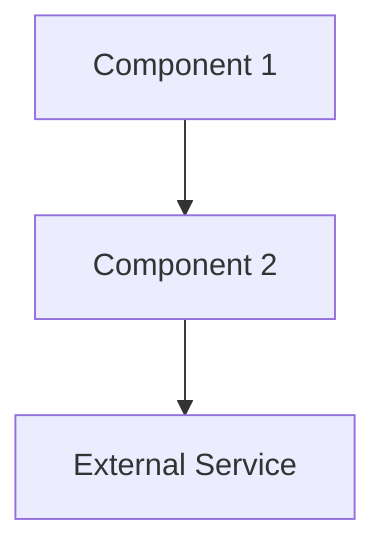

# Architecture

## Overview

<One paragraph: what the system does and how it's structured at a high level.>

## System Components

### <Component 1>

- **Purpose**: <what it does>
- **Technology**: <stack>
- **Location**: `engineering/<path>/`

### <Component 2>

<Repeat.>

## Component Diagram

## External Services & Dependencies

| Service | Purpose | Required? |
|---------|---------|-----------|
| <service> | <why> | <yes/no> |

## Key Technology Choices

| Choice | Rationale |
|--------|-----------|
| <technology> | <why this over alternatives> |

## Data Flow

<Describe how data moves through the system for the primary user action.>

## Deployment

- **Platform**: <where it runs>
- **Build**: <build command>
- **Environment**: <env vars needed>
